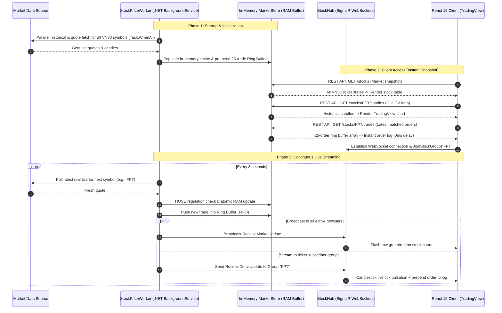

# VN30 Real-Time Stock Trading Terminal

[](https://dotnet.microsoft.com/)
[](https://react.dev/)
[](https://dotnet.microsoft.com/apps/aspnet/signalr)
[](https://www.tradingview.com/lightweight-charts/)
[](https://vitejs.dev/)

A high-performance, real-time Vietnamese stock market (**VN30 / HOSE**) tracking and financial technical analysis terminal. Built with an event-driven architecture combining **ASP.NET Core 8 Web API**, **SignalR (WebSockets)**, and a **React 19** front end powered by **TradingView Lightweight Charts**.

---

## Key Features

- **100% Genuine Market Data:** Streams live quotes and historical daily/intraday candlestick data (OHLCV) directly from the exchange without fake ticks or mock data.
- **Strict HOSE Trading Regulations Compliance:**
  - Enforces official HOSE tick size rules:
    - $< \text{10,000 VND}$: Tick size `0.01`
    - $\text{10,000} - \text{49,950 VND}$: Tick size `0.05`
    - $\ge \text{50,000 VND}$: Tick size `0.10`
  - Automated calculation of Ceiling price ($+7\%$, rounded down) and Floor price ($-7\%$, rounded up).
  - Robust clamping prevents matched trades, daily highs, or daily lows from breaking legal price bands.
- **Interactive TradingView Technical Charting:**
  - Integrated with TradingView's official *Lightweight Charts* engine.
  - Seamless toggle between **Japanese Candlesticks** and **Area/Line Waves**.
  - Multi-timeframe historical inspection (1D, 1M, 3M, 6M, 1Y).
  - Live tick animation: real-time price changes dynamically expand the active candlestick without reloading.
- **Real-Time Bidirectional Streaming with SignalR:**
  - **Whole-Market Broadcast (`Clients.All`):** Real-time electronic price board row-flash animations (green for upticks, red for downticks).
  - **Targeted Group Rooms (`Clients.Group`):** Users only receive dense matched-order feeds for their currently selected ticker, optimizing network bandwidth and client performance.
- **In-Memory Ring Buffer Architecture:**
  - Maintains a thread-safe ring buffer (`ConcurrentQueue`) of the latest 25 matched transactions per stock in server memory.
  - Delivers instantaneous 0ms cold-start response times when switching tickers, eliminating empty wait states.
- **Chart-Centric Responsive UI:**
  - Optimized viewport ratio: **60% Technical Chart & Details** and **40% Compact Order Board**.
  - Fully responsive across 4K displays, standard laptops, tablets, and smartphones.

---

## System Architecture & Data Flow



---

## Technology Stack

### Backend (ASP.NET Core 8 Web API)
- **Runtime:** .NET 8.0 SDK
- **Real-time Protocol:** ASP.NET Core SignalR (WebSocket transport)
- **Background Orchestration:** .NET `BackgroundService` (`StockPriceWorker`)
- **Core .NET / C# Patterns (PRN212 Curriculum):**
  - **Lambda Expressions & Delegates:** Expression-bodied members, Higher-order functions (`Func<T1, T2, TResult>`) for Strategy Pattern rounding.
  - **LINQ Queries & Switch Expressions:** Pattern-matching filtering, sorting, and in-memory analytics.
  - **Asynchronous Parallelism:** `Task.WhenAll` with LINQ projections for non-blocking concurrent I/O.
  - **Thread-Safe In-Memory Storage:** `ConcurrentDictionary<string, T>` and `ConcurrentQueue<T>` ring buffer.

### Frontend (React 19 SPA)
- **Framework:** React 19 + Vite
- **Chart Engine:** TradingView Lightweight Charts (v5)
- **WebSockets:** `@microsoft/signalr` client library
- **Styling:** Vanilla CSS design system with Dark-Mode Financial Terminal aesthetics and CSS Grid layout.

---

## Project Structure

```text
StockTicker/
├── StockTicker.Api/            # ASP.NET Core 8 Web API & SignalR Service
│   ├── Controllers/            # REST API endpoints (Stocks, Candles, Trades)
│   ├── Hubs/                   # SignalR WebSocket Hub (StockHub)
│   ├── Models/                 # DTOs (StockPriceDto, StockCandleDto, StockTradeLogDto)
│   ├── Services/               # MarketStore, HoseRuleHelper, RealMarketDataService, StockPriceWorker
│   └── Program.cs              # DI Container, CORS, and Middleware configuration
├── StockTicker.Client/         # React 19 Frontend Application
│   ├── src/
│   │   ├── components/         # TradingViewChart, StockTable, StockDetailPanel, MarketIndices
│   │   ├── App.jsx             # State management, SignalR lifecycle, and trade cache
│   │   └── index.css           # Terminal design system, responsive grid (60/40)
│   ├── package.json
│   └── vite.config.js
├── StockTicker.slnx            # .NET Solution file
└── .gitignore                  # Git ignore rules for .NET, React, and local AI agent tooling
```

---

## Getting Started

### Prerequisites
- [.NET 8.0 SDK](https://dotnet.microsoft.com/download/dotnet/8.0) or later
- [Node.js](https://nodejs.org/) (v18 or higher) & npm

### 1. Quick Start with Docker (Recommended)
You can build and spin up the entire application stack (Backend + Frontend + Nginx Reverse Proxy) with a single command:

```powershell
docker compose up --build -d
```
- **Web App (Frontend UI):** `http://localhost:3000`
- **Backend API & Swagger:** `http://localhost:5000/swagger`

To stop the containers:
```powershell
docker compose down
```

---

### 2. Manual Local Development

#### A. Run the Backend (.NET API)
```powershell
cd StockTicker.Api
dotnet restore
dotnet run
```
> The API server will be listening at: `http://localhost:5049` (SignalR Hub endpoint: `/stockHub`)

#### B. Run the Frontend (React Client)
```powershell
cd StockTicker.Client
npm install
npm run dev
```
> Open your browser and navigate to: `http://localhost:5173`

---

## Academic Context

Developed as part of the **PRN212 (C# and .NET Core)** curriculum at **FPT University**. Demonstrates enterprise-grade .NET programming paradigms including asynchronous programming, clean architecture, real-time communication, and responsive modern web interfaces.
